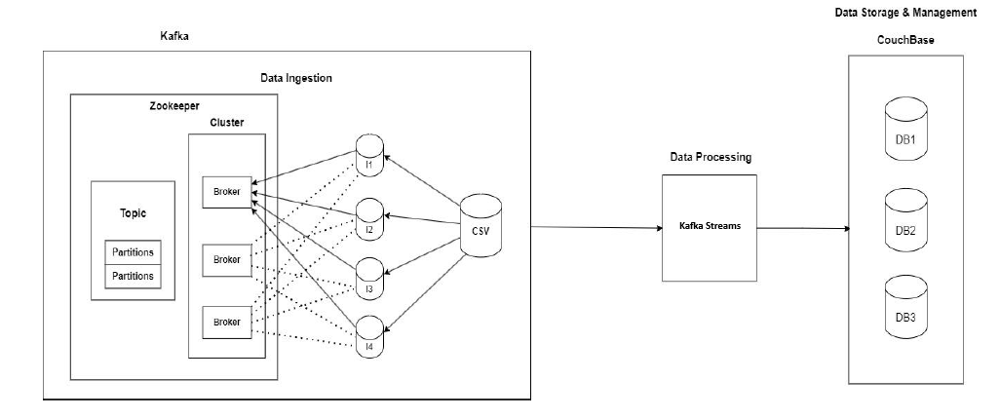

# Real-Time E-Commerce Data Analysis (Distributed Systems)

> A distributed, real-time analytics system for simulating and processing high-volume clickstream data from an e-commerce platform using Apache Kafka, Kafka Streams, Couchbase, and Docker.

---

## 🚀 Project Objective

This project demonstrates the design and implementation of a **scalable, fault-tolerant, containerized distributed system** that ingests large datasets of user click events and performs real-time analytics. It simulates a high-throughput e-commerce environment and leverages Kafka Streams for processing without relying on Apache Flink.

---

## 🧠 Key Features

- **Real-time Data Ingestion** using Kafka producers
- **Stream Processing** using Kafka Streams (not Flink)
- **Distributed NoSQL Storage** using Couchbase
- **Horizontal Scalability** using Docker Compose (Kafka brokers, ingestion services, etc.)
- **Fault Tolerance** using Kafka replication and offsets
- **Data Partitioning** across ingestion services
- **Containerized Microservices** using Docker
- **Ready for UI/Dashboard** integration as a future enhancement

---

## 🏗️ Architecture Overview



> **Legend**:
- `dataIngestion`: Kafka producer containers splitting and feeding data
- `Kafka Cluster`: Two brokers with Zookeeper coordination
- `Kafka Streams`: Consuming and processing data from `views` and `purchase` topics
- `Couchbase`: Persisting transformed results
- `Docker Compose`: Container orchestration

---

## 🧰 Tech Stack

| Component      | Purpose                                    |
|----------------|--------------------------------------------|
| **Apache Kafka**     | Stream-based messaging and data ingestion     |
| **Kafka Streams**    | Real-time stream processing pipeline          |
| **Couchbase**        | Distributed NoSQL document storage            |
| **Docker & Compose** | Containerization and service orchestration    |
| **Python**           | Dataset pre-processing & ingestion logic     |

---

## 📁 Project Structure

```
├── dataIngestion/        # Scripts to load large datasets into Kafka
├── kafka/                # Kafka and Zookeeper service config
├── kafkaStreams/         # Stream processing logic
├── couchbase/            # Couchbase service and setup
├── docker-compose.yml    # Multi-container orchestration
├── dataset/              # Input clickstream dataset (CSV/JSON)
├── system_architecture.png  # System architecture diagram
└── ImportantPoints.txt   # Setup instructions (see below)
```

---

## 📦 Setup Instructions

To set up and run the full system locally via Docker:

> 📝 Refer to `ImportantPoints.txt` for in-depth setup.

### Step-by-step (Quick Start)

```bash
# 1. Clone the repository
git clone https://github.com/SanjayBhargavP/RealTimeE-CommerceDataAnalysisDistributedSystems.git
cd RealTimeE-CommerceDataAnalysisDistributedSystems

# 2. Start the environment with Kafka, Zookeeper, Couchbase
docker-compose -f docker-compose.yml up -d

# 3. Scale data ingestion (e.g., 4 instances)
docker-compose -f docker-compose.yml up -d --scale dataIngestion=4

# 4. Verify Kafka topics and consumer groups (optional)
docker exec -it kafka-1 kafka-topics.sh --list --bootstrap-server kafka-1:9092
```

---

## 🧪 Demo Scenarios

Each scenario below demonstrates a specific distributed systems feature:

| Feature         | How It’s Demonstrated                                                 |
|----------------|------------------------------------------------------------------------|
| **Scalability**     | Scale dataIngestion containers dynamically using Docker Compose    |
| **Reliability**     | Kafka handles broker failures with no data loss                    |
| **Replication**     | Kafka topic-level replication across brokers                        |
| **Fault Tolerance** | Kafka offset tracking + Couchbase + checkpointing recovery         |
| **Containerization**| Entire system deployed in isolated, scalable containers            |

---

## 📊 Sample Dataset

The input dataset simulates user `click` and `purchase` behavior. It is pre-processed and split among producer services based on workload partitioning.

- Topics used: `views`, `purchase`
- Each message contains: timestamp, user ID, product ID, action

---

## 🎯 Future Enhancements

- 📈 **Dashboard** UI using tools like Grafana or React for real-time analytics
- 📊 **Advanced Analytics**: Funnel tracking, sessionization, anomaly detection
- 🔐 **Security**: Integrate OAuth2 or API Gateway
- ☁️ **Cloud Deployment**: Kubernetes-based scaling for production-readiness

---

## 📄 License

This project is licensed under the MIT License.
